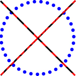

<!-- PROJECT LOGO -->
 

  

<h3 align="center">Kółko i krzyżyk </h3>

  

    Gra kółko i krzyżyk wykonana na zaliczenie z JavaFX
  

<!-- TABLE OF CONTENTS -->

  
Spis treści

  <ol>
    <li>
      <a href="#o-projekcie">O projekcie</a>
      <ul>
        <li><a href="#zbudowane-przy-pomocy">Zbudowane przy pomocy</a></li>
      </ul>
    </li>
    <li><a href="#licencja">Licencja</a></li>
    <li><a href="#kontakt">Kontakt</a></li>
  </ol>

<!-- ABOUT THE PROJECT -->
## O projekcie

- Gra została stworzona z myślą dla 2 graczy.
- Do ustawienia wartości X lub O użyto przycisków wraz ze zdjęciem/ikoną na nich *(ImageView)*.
- W grę można grać zarówno za pomocą myszki jak i klawiatury numerycznej (Numpad'a).

(<a href="#top">back to top</a>)

### Zbudowane przy pomocy

* [JavaFX](https://openjfx.io/)

(<a href="#top">back to top</a>)

<!-- LICENSE -->
## Licencja

Dystrybucja na podstawie licencji MIT. Sprawdź `LICENSE` po więcej informacji.

(<a href="#top">back to top</a>)

<!-- CONTACT -->
## Kontakt

Tomasz Serafiński - work.serafinski@gmail.com

Link do projektu: [https://github.com/tomertin/Tic_Tac_Toe_FX](https://github.com/tomertin/Tic_Tac_Toe_FX/)

(<a href="#top">back to top</a>)

